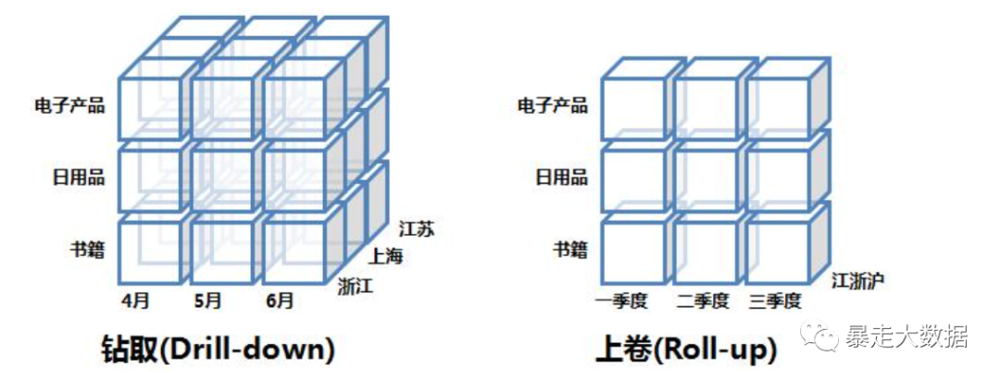

## 基本概念

### 事实表

> 每个数据仓库都包含一个或者多个事实数据表。事实数据表可能包含业务销售数据，如销售商品所产生的数据，与软件中实际表概念一样

- 由主要的两部分构成
	一是由主键和外键所组成的键部分，
	另一部分是用户希望在数据仓库中所了解的数值指标，这些指标是为每个派生出来的键而定义和计算的，称为事实或指标
- 事实表则是位于星形架构或雪花形架构中间，用来记录商务事实和相应统计指标的表。
- 事实表中除了度量变量外，其他字段都是同维表或者中间表（对于雪花形模型）的关键字。
- 只有数字
- 维度字段为维度表的外键
	维度中的属性描述的是维本身的属性，比如客户的性别、年龄、姓名和地址，这些都是客户的固有属性。
- 度量字段为连续值
	度量是客户发生事件或动作的事实记录，比如客户打电话，可能选择的度量有通话时长、通话次数和通话费用等；客户购买商品，可能选择的度量有购买的次 数、购买商品的金额和购买商品的数量等。
	度量变量的取值可以是离散的数值，也可以是连续的数值。比如，客户通话次数是离散的数值，而客户购买商品的金额是 连续的数值。度量变量也可以在某个元素集合内取值。比如客户对公司服务质量的评定可以是很好（Excellent）、好（Good）、一般（Fair）和 差（Poor）中的一个。

 

### 维度

说明数据，维度是指可指定不同值的对象的描述性属性或特征。例如，地理位置的维度可以包括“纬度”、“经度”或“城市名称”。“城市名称”维度的值可以为“旧金山”、“柏林”或“新加坡”。

 

### 指标

衡量数据，指标是指可以按总数或比值衡量的具体维度元素。例如，维度“城市”可以关联指标“人口”，其值为具体城市的居民总数。

 

### 度量

事实表和维度交叉汇聚的点，度量和维度构成OLAP的主要概念，这里面对于在事实表或者一个多维立方体里面存放的数值型的、连续的字段，就是度量。这符合上面的意思，有标准，一个度量字段肯定是统一单位，例如元、户数。如果一个度量字段，其中的度量值可能是欧元又有可能是美元，那这个度量可没法汇总。在统一计量单位下，对不同维度的描述。


### 指标与度量的关系

这就得说到指标，我愿意表述为"它是表示某种相对程度的值"。区别于上面的度量概念，那是一种绝对值，尺子量出来的结果，汇总出来的数量等。而指标至少需要两个度量之间的计算才能得到，例如收入增长率，用本月收入比上上月收入。当然可能指标的计算还需要两个以上的度量

### 维度和指标的关系

虽然维度和指标可以独立使用，但常见的还是相互结合使用。维度和指标的值以及这些值之间的关系，使您的数据具有了意义。为了挖掘尽可能多的深层次信息，维度通常与一个或多个指标关联在一起。

例如，维度“城市”可以与指标“人口”和“面积”相关联。有了这些数据，系统还可以创建“人口密度”等比值指标，带来有关这些城市的更详细的深入信息。


## 实例

### 星型模型（1）

Prerequisite – [Introduction to Big Data](https://www.geeksforgeeks.org/the-big-data-world-big-bigger-and-biggest/), [Benefits of Big data](https://www.geeksforgeeks.org/benefits-big-data/) 
**Star schema** is the fundamental schema among the data mart schema and it is  simplest. This schema is widely used to develop or build a data  warehouse and dimensional data marts. It includes one or more fact  tables indexing any number of dimensional tables. The star schema is a  necessary cause of the snowflake schema. It is also efficient for  handling basic queries. 

It is said to be star as its physical  model resembles to the star shape having a fact table at its center and  the dimension tables at its peripheral representing the star’s points.  Below is an example to demonstrate the Star Schema: 

 


In the above demonstration, SALES is a fact table having attributes i.e.  (Product ID, Order ID, Customer ID, Employer ID, Total, Quantity,  Discount) which references to the dimension tables. **Employee dimension table** contains the attributes: Emp ID, Emp Name, Title, Department and Region. *Product dimension table* contains the attributes: Product ID, Product Name, Product Category, Unit Price. *Customer dimension table* contains the attributes: Customer ID, Customer Name, Address, City, Zip. *Time dimension table* contains the attributes: Order ID, Order Date, Year, Quarter, Month. 

**Model of Star Schema :** 
In Star Schema, Business process data, that holds the quantitative data  about a business is distributed in fact tables, and dimensions which are descriptive characteristics related to fact data. Sales price, sale  quantity, distant, speed, weight, and weight measurements are few  examples of fact data in star schema. 
Often, A Star Schema having  multiple dimensions is termed as Centipede Schema. It is easy to handle a star schema which have dimensions of few attributes. 

**Advantages of Star Schema :** 

1. **Simpler Queries –**
   Join logic of star schema is quite cinch in comparison to other join logic  which are needed to fetch data from a transactional schema that is  highly normalized.
2. **Simplified Business Reporting Logic –** 
   In comparison to a transactional schema that is highly normalized, the  star schema makes simpler common business reporting logic, such as as-of reporting and period-over-period.
3. **Feeding Cubes –** 
   Star schema is widely used by all OLAP systems to design OLAP cubes  efficiently. In fact, major OLAP systems deliver a ROLAP mode of  operation which can use a star schema as a source without designing a  cube structure.

**Disadvantages of Star Schema –** 

1. Data integrity is not enforced well since in a highly de-normalized schema state.
2. Not flexible in terms if analytical needs as a normalized data model.
3. Star schemas don’t reinforce many-to-many relationships within business entities – at least not frequently.

### 星型模型（2）


### 切片、下钻、上卷

[原文链接](https://www.modb.pro/db/135501)

在介绍OLAP工具的具体使用前，先要了解这个概念：数据立方体(Data Cube)。

很多年前，当我们要手工从一堆数据中提取信息时，我们会分析一堆数据报告。通常这些数据报告采用二维表示，是行与列组成的二维表格。但在真实世界里我们分析数据的角度很可能有多个，数据立方体可以理解为就是维度扩展后的二维表格。下图展示了一个三维数据立方体：


尽管这个例子是三维的，但更多时候数据立方体是N维的。它的实现有两种方式，本文后面部分会讲到。其中上一篇讲到的星形模式就是其中一种，该模式其实是一种连接关系表与数据立方体的桥梁。但对于大多数纯OLAP使用者来讲，数据分析的对象就是这个逻辑概念上的数据立方体，其具体实现不用深究。对于这些OLAP工具的使用者来讲，基本用法是首先配置好维表、事实表，然后在每次查询的时候告诉OLAP需要展示的维度和事实字段和操作类型即可。

下面介绍数据立方体中最常见的五大操作：切片，切块，旋转，上卷，下钻。

1. 切片和切块(Slice and Dice)

   在数据立方体的某一维度上选定一个维成员的操作叫切片，而对两个或多个维执行选择则叫做切块。下图逻辑上展示了切片和切块操作：


​	这两种操作的SQL模拟语句如下，主要是对WHERE语句做工作：

​	

```sql
# 切片
SELECT Locates.地区, Products.分类, SUM(数量)
FROM Sales, Dates, Products, Locates
WHERE Dates.季度 = 2
    AND Sales.Date_key = Dates.Date_key
    AND Sales.Locate_key = Locates.Locate_key
    AND Sales.Product_key = Products.Product_key
GROUP BY Locates.地区, Products.分类


# 切块
SELECT Locates.地区, Products.分类, SUM(数量)
FROM Sales, Dates, Products, Locates
WHERE (Dates.季度 = 2 OR Dates.季度 = 3) AND (Locates.地区 = '江苏' OR Locates.地区 = '上海')
    AND Sales.Date_key = Dates.Date_key
    AND Sales.Locate_key = Locates.Locate_key
    AND Sales.Product_key = Products.Product_key
GROUP BY Dates.季度, Locates.地区, Products.分类	
```

2. 旋转(Pivot)

   旋转就是指改变报表或页面的展示方向。对于使用者来说，就是个视图操作，而从SQL模拟语句的角度来说，就是改变SELECT后面字段的顺序而已。下图逻辑上展示了旋转操作：


3. 上卷和下钻(Rol-up and Drill-down)

   上卷可以理解为"无视"某些维度；下钻则是指将某些维度进行细分。下图逻辑上展示了上卷和下钻操作：




这两种操作的SQL模拟语句如下，主要是对GROUP BY语句做工作：


```sql
# 上卷
SELECT Locates.地区, Products.分类, SUM(数量)
FROM Sales, Products, Locates
WHERE Sales.Locate_key = Locates.Locate_key
    AND Sales.Product_key = Products.Product_key
GROUP BY Locates.地区, Products.分类


# 下钻
SELECT Locates.地区, Dates.季度, Products.分类, SUM(数量)
FROM Sales, Dates, Products, Locates
WHERE Sales.Date_key = Dates.Date_key
    AND Sales.Locate_key = Locates.Locate_key
    AND Sales.Product_key = Products.Product_key
GROUP BY Dates.季度.月份, Locates.地区, Products.分类
```
