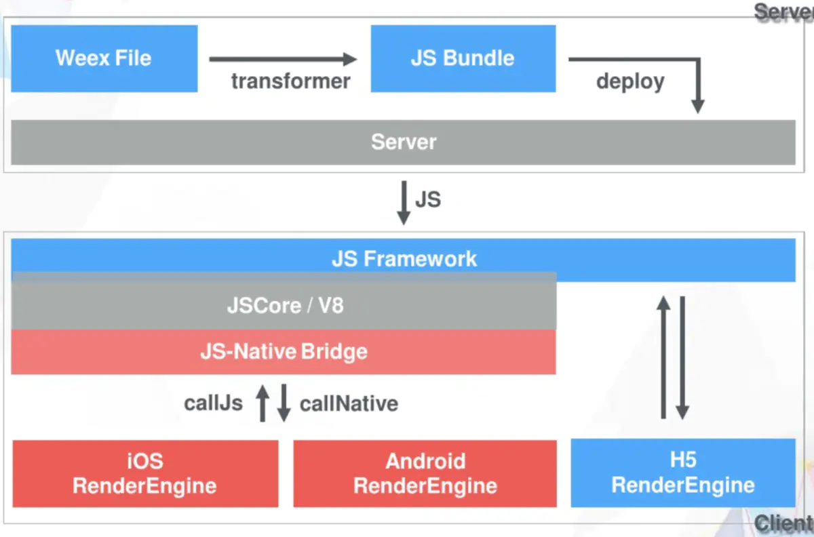
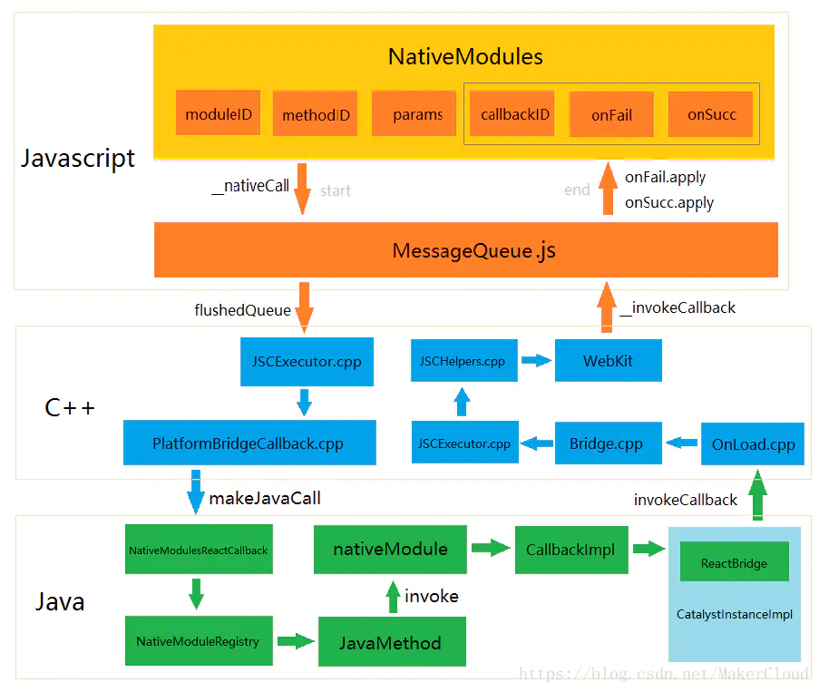
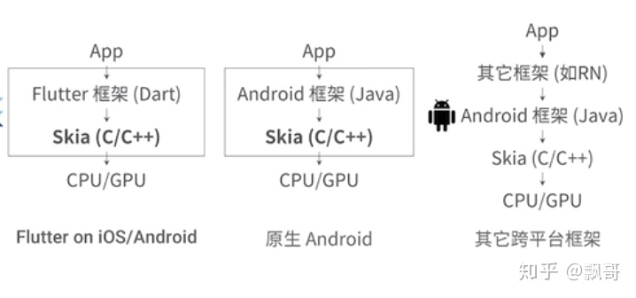
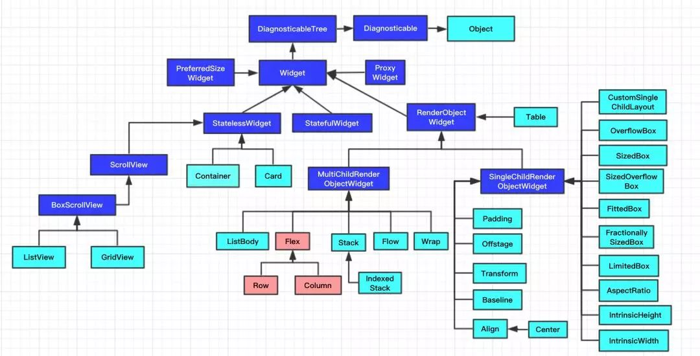

IFlutter
====

## 移动端跨平台开发

### 移动端开发的痛点

#### 原生开发效率低

android和ios代码不可复用，独立开发难度。

#### webview的问题

 WebView 容器性能差，兼容性一般，需要调用底层功能，需要开发插件

#### 版本升级成本高

原生开发意味着任何改动都需要发版，较多的商店，特别是苹果的严格审核，导致线上问题处理痛苦。

（苹果商店的审核风险：官方的公告原意是说应用程序的核心特性和功能必须包含在软件的二进制文件中，而不是通过类似 HTML5 的技术来实现动态更新，苹果要打压的是动态更新技术）

不支持灰度发布

#### 不干净的跨平台

每种跨平台方案都有优缺点，需要取舍

### 移动端跨平台方案

#### 技术发展趋势

#### 1.web容器

- cordova为代表
- js\html
- 为了解决原生开发的高成本、低效率。
- 性能较差、底层控制较差。
- web渲染

#### 2.泛web容器

- react-native和weex为代表
- js\ts\vue\react
- 功能裁剪、体验接近于原生、需要开发扩展
- 平台兼容有差异
- **平台原生渲染**（Android、ios）

#### 3.自绘引擎

- Flutter为代表
- dart
- iOS、Android、Fuchsia、web、hongmeng？
- **自带渲染引擎渲染视图**（无java、无jvm、无Android）

### 几种主流技术

#### Weex

#### React-native



#### 总结



### 怎么选择

#### 项目OR产品

1. 项目需要的快速实现，降低技术成本=>web容器或者泛web方案
2. 产品更关注持续性和快速迭代=>泛web或者自绘引擎

#### 团队技术结构

1. 擅长可视化布局技术（html+css+js）=>web容器或者泛web方案
2. 擅长声明式布局（vue/react）=>泛web方案、自绘引擎

### 技术发展趋势

1. 所有的一切技术发展都是 **利益驱动** 的结果（研发效率）。
2. 学习成本很容易在研发过程中被磨平
3. 基础技术层越来越薄，越来越多被隐藏起来，越来越不是技术——称为知识
4. 技术壁垒越来越薄，从前端到后端、从设计到开发、从测试到运维，越来越强调融合
5. 时代在快速发展、技术在快速发展、思想要跟上脚步

### 国内使用情况

#### 京东

##### React-Native

基于React-native研发JDReact，打通Android、IOS、web（reactjs）

**增加热更新**

性能优化、内存优化

react-native**降级**reactjs

##### flutter

JDFlutter

未大规模使用

#### 美团

##### RN

刚开始native方式研发，多个app之间通过共享native包的方式共用。

转向react-native，MRN（meituan React Native）

容器化


##### Flutter

商家端

flutter web

#### 字节

##### flutter

今日头条、西瓜视频、皮皮虾等 20 多个业务在使用 Flutter 开发，有纯 Flutter 工程，也有 Flutter 与 Native 的混合工程。

#### 阿里

##### react Native

手淘和天猫曾经尝试过React Native，然后放弃了。

##### weex

基于weapp迭代为weex

1. React Native的JSX、CSS in JS写法都很别扭，淘宝有很多ISV（即各种店铺），他们之前只会Web技术，写这个有门槛。另外，HTML标准在过去二十年内经受了检验，HMTL/CSS/JS对应的结构、样式和行为，天然分离，代码的可维护性会更好。抛弃标准自己发明DSL也不明智

2. 手淘之前有WeApp，从WeApp进化到Weex是很自然的选择，抛弃自己的解决方案去用别人的反而很奇怪。

3. React Native重视平台独立性，不能做到100%代码共用，实际上还是要学习各平台的特性，Weex希望做到100%共用，即一次编写到处运行，进一步降低开发门槛

4. React Native在一些地方的性能上还有问题，手淘希望能自己主导优化的进程，否则会很被动。

   

#### 腾讯

##### react native

腾讯课堂 RN+

体积性能优化

### 其他

Airbnb放弃react-native：不一致、不兼容、跟进慢


## Flutter

### Dart

Dart语言由谷歌制造，用来替代Javascript，弥补Javascript在web应用中大量使用时出现的缺点。对于Dart语言，谷歌的希望是，它将成为web编程的新官方语言。

Chromium 中所整合的虚拟机（Dart VM）

 JIT 和AOT

单线程


### 架构


### Framework

#### Foundation

其中定义的大都是非常基础的、提供给其他所有层使用的工具类和方法。

#### Painting

封装了Flutter Engine提供的绘制接口，主要是为了在绘制控件等固定样式的图形时提供更直观、更方便的接口，比如绘制缩放后的位图、绘制文本、插值生成阴影以及在盒子周围绘制边框等等。

#### Animation

是动画相关的类，提供了类似Android系统的ValueAnimator的功能，并且提供了丰富的内置插值器。

#### Gesture

提供了手势识别相关的功能，包括触摸事件类定义和多种内置的手势识别器。GestureBinding类是Flutter中处理手势的抽象服务类，继承自BindingBase类。Binding系列的类在Flutter中充当着类似于Android中的SystemService系列（ActivityManager、PackageManager）功能，每个Binding类都提供一个服务的单例对象，App最顶层的Binding会包含所有相关的Bingding抽象类。如果使用Flutter提供的控件进行开发，则需要使用WidgetsFlutterBinding，如果不使用Flutter提供的任何控件，而直接调用Render层，则需要使用RenderingFlutterBinding。

#### Rendering

Flutter的控件树在实际显示时会转换成对应的渲染对象（`RenderObject`）树来实现布局和绘制操作。一般情况下，我们只会在调试布局，或者需要使用自定义控件来实现某些特殊效果的时候，才需要考虑渲染对象树的细节

#### Widgets

Flutter的控件库提供了非常丰富的控件，包括最基本的文本、图片、容器、输入框和动画等等。在Flutter中“一切皆是控件”，通过组合、嵌套不同类型的控件，就可以构建出任意功能、任意复杂度的界面。

### Engine

Flutter 的核心，它主要使用 C++ 编写，并提供了 Flutter 应用所需的原语。当需要绘制新一帧的内容时，引擎将负责对需要合成的场景进行栅格化。它提供了 Flutter 核心 API 的底层实现，包括图形（通过 [Skia](https://skia.org/)）、文本布局、文件及网络 IO、辅助功能支持、插件架构和 Dart 运行环境及编译环境的工具链。

引擎将底层 C++ 代码包装成 Dart 代码，通过 [`dart:ui`](https://github.com/flutter/engine/tree/master/lib/ui) 暴露给 Flutter 框架层。该库暴露了最底层的原语，包括用于驱动输入、图形、和文本渲染的子系统的类。

### Embedder

平台嵌入层是用于呈现所有 Flutter 内容的原生系统应用，它充当着宿主操作系统和 Flutter 之间的粘合剂的角色。当你启动一个 Flutter 应用时，嵌入层会提供一个入口，初始化 Flutter 引擎，获取 UI 和栅格化线程，创建 Flutter 可以写入的纹理。嵌入层同时负责管理应用的生命周期，包括输入的操作（例如鼠标、键盘和触控）、窗口大小的变化、线程管理和平台消息的传递。 Flutter 拥有 Android、iOS、Windows、macOS 和 Linux 的平台嵌入层，当然，开发者可以创建自定义的嵌入层，正如这个 [可用的例子](https://github.com/chinmaygarde/fluttercast) 以 VNC 风格的帧缓冲区支持了远程 Flutter，还有 [支持树莓派运行的例子]https://github.com/ardera/flutter-pi)。


### 优缺点

1. 真正的`Build apps for any screen`

   windows、linux、web、Android、IOS、fuchisa、hongmeng

2. 强大的社区支持

3. 出色的性能

4. 跨平台高度一致性

5. 不便的动态更新

6. 高成本的native交互

   Androidview、webview

7. 体积略大

8. 需要前端懂原生

## 动态部署


## install

### .pub-cache change

```
export PUB_CACHE=/TOOLS/SDK/flutter_linux/.pub-cache
```


### adroid-studio

安装插件flutter

### 问题处理

#### java.lang.NoClassDefFoundError: javax/xml/bind/annotation/XmlSchema

Installing **Android SDK Command-line tools** from **Android SDK Manager** did the job for me.

1. Open **Tools** > **SDK Manager**
2. From the left choose, **Appearance & Behavior** > **System Settings** > **Android SDK**
3. Select **SDK Tools** from the top menu
4. Check **Android SDK Command-line tools** and click 'apply'.
5. `./flutter doctor --android-licenses`


## 开发




### 编程范式

Flutter 是一个多范式的编程环境。过去几十年中许多编程技术都有在 Flutter 中使用。我们在选择范式时会考虑其适用性进行综合性的决策。以下列出的范式不分先后：

**组合 (composition)**
这也是 Flutter 的主要开发范式，将简单的、行为有限的小对象进行组合，从而实现更复杂的效果。绝大多数 Flutter widget 都是用这种方法构建的。比如 Material [`TextButton`](https://api.flutter-io.cn/flutter/material/TextButton-class.html) 类是基于 [`MaterialButton`](https://api.flutter-io.cn/flutter/material/MaterialButton-class.html) 类构建的，而这个类则是由 [`IconTheme`](https://api.flutter-io.cn/flutter/widgets/IconTheme-class.html)、[`InkWell`](https://api.flutter-io.cn/flutter/material/InkWell-class.html)、[`Padding`](https://api.flutter-io.cn/flutter/widgets/Padding-class.html)、 [`Center`](https://api.flutter-io.cn/flutter/widgets/Center-class.html)、[`Material`](https://api.flutter-io.cn/flutter/material/Material-class.html)、[`AnimatedDefaultTextStyle`](https://api.flutter-io.cn/flutter/widgets/AnimatedDefaultTextStyle-class.html) 以及 [`ConstrainedBox`](https://api.flutter-io.cn/flutter/widgets/ConstrainedBox-class.html) 组合而成的。而 [`InkWell`](https://api.flutter-io.cn/flutter/material/InkWell-class.html) 则是由 [`GestureDetector`](https://api.flutter-io.cn/flutter/widgets/GestureDetector-class.html) 组成， [`Material`](https://api.flutter-io.cn/flutter/material/Material-class.html) 则是由 [`AnimatedDefaultTextStyle`](https://api.flutter-io.cn/flutter/widgets/AnimatedDefaultTextStyle-class.html)、[`NotificationListener`](https://api.flutter-io.cn/flutter/widgets/NotificationListener-class.html) 和 [`AnimatedPhysicalModel`](https://api.flutter-io.cn/flutter/widgets/AnimatedPhysicalModel-class.html) 组成。如此等等。

**函数式编程 (functional programming)**
整个应用都可以只用 [`StatelessWidget`](https://api.flutter-io.cn/flutter/widgets/StatelessWidget-class.html) 来构建，它本质上就是一些方法，用来描述如何将参数传送给其他方法，以及在布局区域内计算布局以及绘制图像。当然这样的应用一般也不会包含状态，所以通常也无法进行交互。比如，[`Icon`](https://api.flutter-io.cn/flutter/widgets/Icon-class.html) widget 就只是一个将其元素（[颜色](https://api.flutter-io.cn/flutter/widgets/Icon/color.html)、[图标](https://api.flutter-io.cn/flutter/widgets/Icon-class.html)、[尺寸](https://api.flutter-io.cn/flutter/widgets/Icon/size.html)）罗列在布局区域内的方法。另外，当这个范式被重度使用时，则会使用不可变的数据结构，如整个 [`Widget`](https://api.flutter-io.cn/flutter/widgets/Widget-class.html) 类及其派生，以及一些辅助类，如 [`Rect`](https://api.flutter-io.cn/flutter/dart-ui/Rect-class.html) 和 [`TextStyle`](https://api.flutter-io.cn/flutter/painting/TextStyle-class.html)。另外，从一个较小的尺度来看的话， Dart 的 [`Iterable`](https://api.flutter-io.cn/flutter/dart-core/Iterable-class.html) API 也重度使用了这个范式 (如 map, reduce, where 等方法），它在框架中经常被用来处理一系列的值。

**事件驱动编程 (event-driven programming)**
用户的交互操作被包装成事件对象，这些对象发送给被各个 event handler 注册的回调方法。屏幕内容的更新使用的也是类似的回调机制。比如，做为动画系统构建基础的 [`Listenable`](https://api.flutter-io.cn/flutter/foundation/Listenable-class.html) 类，就采用了包含多个事件监听者的订阅模型。

**面向类编程 (class-based programming，是面向对象编程的一种方式)**
框架内绝大多数的 API 是由包含各种继承关系的类来组成的。我们在基本类中定义较高级别的 API，然后在其子类中对这些 API 进行特化处理。比如，我们的渲染对象就有一个基本类 [`RenderObject`](https://api.flutter-io.cn/flutter/rendering/RenderObject-class.html))，它对坐标系的细节并不关心，但它的子类 [`RenderBox`](https://api.flutter-io.cn/flutter/rendering/RenderBox-class.html)) 就引入了笛卡尔坐标系的概念（x/y坐标值，以及宽度高度的概念）。

**原型编程 (prototype-based programming，同样是面向对象编程的一种方式)**
[`ScrollPhysics`](https://api.flutter-io.cn/flutter/widgets/ScrollPhysics-class.html) 类在运行时动态链接那些会组成滚动逻辑的实例。这就使得系统无需在编译时提前选择平台的情况下，也能组合出符合平台特性的页面滚动效果。

**指令式编程 (imperative programming)**
简单直白的指令式编程，通常和对象内封装的状态 (state) 搭配使用，这种范式能提供最符合直觉的解法。比如，测试就是使用指令式编程实现的，首先描述出测试的环境，然后给出测试需要满足的定量，最后开始步进，或者根据测试需要插入事件。

**响应式编程 (reactive programming)**
Widget 和元素树有时候被描述为响应式的，因为随 widget 构造方法引入的新输入会随着其 build 方法传播给更低等级的 widget；而底层 widget 中出现的修改 (如响应用户的输入) 也会沿着结构树通过 event handler 向上传播。在整个框架中，函数-响应式以及指令-响应式的实现都有出现，具体取决于 widget 的功能需求。 Widget 的 build 方法如果只是包含其针对变化如何响应的表达式的话，就是函数-响应式 widget (如 Material [`Divider`](https://api.flutter-io.cn/flutter/material/Divider-class.html) 类)。如果 widget 的 build 方法包含一系列构造子元素的表达式，用于描述该 widget 如何响应变化的话，那它就是指令响应式 widget (如 [`Chip`](https://api.flutter-io.cn/flutter/material/Chip-class.html) 类)。

**声明式编程 (declarative programming)**
Widget 的 build 方法通常都是一个单一表达式，它包含多级嵌套的构造函数，且使用 Dart 严格的声明式子集编写。这些嵌套的表达式可以与合适的标记语言互相转换。比如，[`UserAccountsDrawerHeader`](https://api.flutter-io.cn/flutter/material/UserAccountsDrawerHeader-class.html) 这个 widget 就有一个很长的 build 方法 (20 多行)，由一个嵌套的表达式构成。这种范式也可以和指令式混合使用，以实现某些很难用纯声明式的方法实现的 UI。

**泛型程序设计 (generic programming)**
类型可以帮助开发者更早地抓到错误，基于这一点，Flutter 框架也采用了泛型开发。比如，[`State`](https://api.flutter-io.cn/flutter/widgets/State-class.html) 类就是如此，其关联的 widget 就是类型参数，如此一来 Dart 分析器就能捕获到 state 和 widget 不匹配的情况。类似的，[`GlobalKey`](https://api.flutter-io.cn/flutter/widgets/GlobalKey-class.html) 类就接受一个类型参数，从而类型安全地访问一个 widget 的 state (会使用运行时检查)。 [`Route`](https://api.flutter-io.cn/flutter/widgets/Route-class.html) 接口也在被 [popped](https://api.flutter-io.cn/flutter/widgets/Navigator/pop.html) 时接受类型参数，另外 [`List`](https://api.flutter-io.cn/flutter/dart-core/List-class.html), [`Map`](https://api.flutter-io.cn/flutter/dart-core/Map-class.html), [`Set`](https://api.flutter-io.cn/flutter/dart-core/Set-class.html) 这些集合也都如此，这样就可以在分析或者运行时尽早发现类型不匹配的错误。

**并发 (concurrent programming)**
Flutter 大量使用诸如 [`Future`](https://api.flutter-io.cn/flutter/dart-async/Future-class.html) 等异步 API。比如，动画系统就会在动画执行完 future 时进行事件告知。同样的，图片加载系统也会使用 future 在加载完毕时进行告知。

**约束编程 (constraint programming)**
Flutter 的布局系统使用了约束编程的简化形态来描述一个场景的几何性质。约束值 (比如一个笛卡尔矩形允许的最大 / 最小宽高值) 会从父元素传递给子元素，子元素最终选择一个能满足上面所有约束条件的最终尺寸。这种做法也使得 Flutter 能不依赖太多输入的情况下快速完成一个全新的布局。


### 布局

#### widget

1. StatelessWidget

   它没要需要管理的内部状态，是无状态的。另外一种是可变状态的.

   无状态：不会被改变的Widget，例如纯展示页面，数据也不会改变

2. StatefulWidget

   它有需要管理的内部状态，使用`setState`来管理状态改变。 Widget是有状态的还是无状态的，取决于他们依赖于状态的变化：

   有状态：交互或者数据改变导致Widget改变，例如改变文案

#### container

用来设置背景、设置大小、设置边距(padding)的布局。

#### center

#### Align

`Align`组件可以调整子组件的位置，并且可以根据子组件的宽高来确定自身的宽高

```dart
Container(
  height: 200.0,
  width: 200.0,
  color: Colors.blue[50],
  child: Align(
	  alignment: Alignment.topRight,
	  child: Image(
		width: 100,
		height: 100,
		image: AssetImage('Test.jpg'),
	  )),
);
```


#### column

#### flex


#### row

#### WallLayout

#### Drawer

#### Expanded

Expanded是用于展开`Row`，`Column`或`Flex`的子`child`的Widget

#### KeepAliveWrapper


### 动画

#### ScaleTransition

### 状态管理

#### createState()


#### setState()

更新UI

```dart
 void _handleTap() {
    if(!mounted)return;
    setState(() {
      _active = !_active;
    });
  }
```

mounted表明 State 当前是否正确绑定在View树中,mounted = false 时，调用setState()会报错。所以任何时候调用setState()都应检测mounted。

Whether this [State](https://api.flutter.dev/flutter/widgets/State-class.html) object is currently in a tree.

After creating a [State](https://api.flutter.dev/flutter/widgets/State-class.html) object and before calling [initState](https://api.flutter.dev/flutter/widgets/State/initState.html), the framework "mounts" the [State](https://api.flutter.dev/flutter/widgets/State-class.html) object by associating it with a [BuildContext](https://api.flutter.dev/flutter/widgets/BuildContext-class.html). The [State](https://api.flutter.dev/flutter/widgets/State-class.html) object remains mounted until the framework calls [dispose](https://api.flutter.dev/flutter/widgets/State/dispose.html), after which time the framework will never ask the [State](https://api.flutter.dev/flutter/widgets/State-class.html) object to [build](https://api.flutter.dev/flutter/widgets/State/build.html) again.

It is an error to call [setState](https://api.flutter.dev/flutter/widgets/State/setState.html) unless [mounted](https://api.flutter.dev/flutter/widgets/State/mounted.html) is true.

### 路由管理

### 异步开发

#### Future

await


async

### 原生调用

## 工程结构

### 宿主

运行Flutter程序时需要对应平台的宿主工程，在Android上Flutter通过自动创建一个Gradle项目来生成宿主，在项目目录下执行`flutter create .`，Flutter会创建ios和android两个目录，分别构建对应平台的宿主项目。

### 目录结构


## 动态化

### 热修复步骤

Flutter SDK 1.2.1中，Google提供了ResourceUpdater，用来做包的检查和下载解压。升级步骤如下：

## 参考文献

QQ看点团队开源方案：[《基于JS的高性能Flutter动态化框架》](https://link.juejin.cn/?target=https%3A%2F%2Fgithub.com%2FTGIF-iMatrix%2FMXFlutter%2Fblob%2Fmaster%2FDocumentation%2F%E5%9F%BA%E4%BA%8EJS%E7%9A%84%E9%AB%98%E6%80%A7%E8%83%BD%E5%8A%A8%E6%80%81%E5%8C%96%E6%A1%86%E6%9E%B6%E8%AF%A6%E7%BB%86%E4%BB%8B%E7%BB%8D.md)

美团：[Flutter的原理与实践](https://tech.meituan.com/2018/08/09/waimai-flutter-practice.html)

