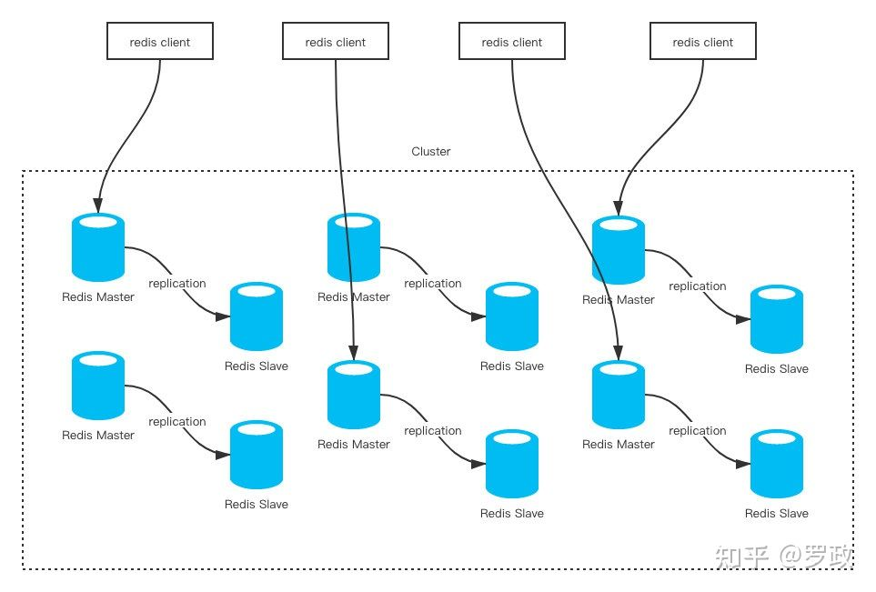

# reids

## 基本概念

sharding：分片

replication：复制

## 安装

```sh
$reidis_home/make MALLOC=libc
$make
```
### 单机
1. 启动
```sh
./redis-server ../redis.conf
```
2. 命令
```sh
#./redis-cli KEYS "SITE_ALARM_PERSON_PREFIX*"|xargs ./redis-cli DEL
#./redis-cli KEYS "*"
```
3. save

```sh
#redis 127.0.0.1:6379> SAVE 
会产生如下文件：/home/docker/dump.rdb
#redis 127.0.0.1:6379> BGSAVE
#>CONFIG GET maxclients
```
4. 恢复数据
如果需要恢复数据，只需将备份文件 (dump.rdb) 移动到 redis 安装目录并启动服务即可。获取 redis 目录可以使用 CONFIG 命令，如下所示：
```sh
#redis 127.0.0.1:6379> CONFIG GET dir
		1) "dir"
		2) "/usr/local/redis/bin"
$./redis-cli config get maxclients
$./redis-cli config get "*"
redis :6379 > shutdown
关闭服务# redis-cli shutdown 
```
###  配置存储路径
	$vi $redis_home/redis.conf
	dir /cloud/redis
### 配置日志
	dir /cloud/reids.log
### 刷写数据
	$./redis-cli save
### 清理数据

## 主从复制

### 作用

1. 数据冗余：主从复制实现了数据的热备份，是持久化之外的一种数据冗余方式。

2. 故障恢复：当主节点出现问题时，可以由从节点提供服务，实现快速的故障恢复；实际上是一种服务的冗余。

3. 负载均衡：在主从复制的基础上，配合读写分离，可以由主节点提供写服务，由从节点提供读服务（即写Redis数据时应用连接主节点，读Redis数据时应用连接从节点），分担服务器负载；尤其是在写少读多的场景下，通过多个从节点分担读负载，可以大大提高Redis服务器的并发量。

4. 读写分离：可以用于实现读写分离，主库写、从库读，读写分离不仅可以提高服务器的负载能力，同时可根据需求的变化，改变从库的数量；

5. 高可用基石：除了上述作用以外，主从复制还是哨兵和集群能够实施的基础，因此说主从复制是Redis高可用的基础。


## 切片

### 三种切片方式

#### 客户端实现数据分片 

即客户端自己计算数据的key应该在哪个机器上存储和查找，此方法的好处是降低了服务器集群的复杂度，客户端实现数据分片时，服务器是独立的，服务器之前没有任何关联。多数redis客户端库实现了此功能，也叫**sharding**,这种方式的缺点是客户端需要实时知道当前集群节点的联系信息，同时，当添加一个新的节点时，客户端要支持动态sharding.，多数客户端实现不支持此功能，需要重启redis。另一个弊端是redis的HA需要额外考虑。

 

#### 服务器实现数据分片 

其理论是，客户端随意与集群中的任何节点通信，服务器端负责计算某个key在哪个机器上，当客户端访问某台机器时，服务器计算对应的key应该存储在哪个机器，然后把结果返回给客户端，客户端再去对应的节点操作key，是一个重定向的过程，此方式是redis3.0正在实现，目前处于beta版本， Redis 3.0的集群同时支持HA功能，某个master节点挂了后，其slave会自动接管。

#### 通过代理服务器实现数据分片 

此方式是借助一个代理服务器实现数据分片，客户端直接与proxy联系，proxy计算集群节点信息，并把请求发送到对应的集群节点。降低了客户端的复杂度，需要proxy收集集群节点信息。Twemproxy是twitter开源的，实现这一功能的proxy。这个实现方式在客户端和服务器之间加了一个proxy，但这是在redis 3.0稳定版本出来之前官方推荐的方式。结合redis-sentinel的HA方案，是个不错的组合。

### redis cluster



Redis Cluster要求至少需要3个master才能组成一个集群，同时每个master至少需要有一个slave节点。各个节点之间保持TCP通信。当master发生了宕机， Redis Cluster自动会将对应的slave节点提拔为master，来重新对外提供服务。

Redis Cluster 功能 ： **负载均衡，故障切换**，**主从复制** 。

#### 安装


#### 数据切片和实例的对应分布关系

从 3.0 开始，官方提供了一个名为 Redis Cluster 的方案，用于实现切片集群。Redis Cluster 方案中就规定了数据和实例的对应规则。

#### hash slot

Redis Cluster 方案采用哈希槽（Hash Slot，接下来我会直接称之为  Slot），来处理数据和实例之间的映射关系。在 Redis Cluster 方案中，一个切片集群共有 16384  个哈希槽，这些哈希槽类似于数据分区，每个键值对都会根据它的 key，被映射到一个哈希槽中。

#### 步骤

1. 首先根据键值对的 key，按照CRC16 算法计算一个 16 bit 的值；然后，再用这个 16bit 值对 16384 取模，得到 0~16383 范围内的模数，每个模数代表一个相应编号的哈希槽。
2. 在部署 Redis Cluster 方案时，使用 cluster create 命令创建集群，此时，Redis  会自动把这些槽平均分布在集群实例上。例如，如果集群中有 N 个实例，那么，每个实例上的槽个数为 16384/N 个。当然， 我们也可以使用  cluster meet 命令手动建立实例间的连接，形成集群，再使用 cluster addslots 命令，指定每个实例上的哈希槽个数。**在手动分配哈希槽时，需要把 16384 个槽都分配完，否则 Redis 集群无法正常工作。**

#### 客户端如何定位数据？

一般来说，客户端和集群实例建立连接后，实例就会把哈希槽的分配信息发给客户端。但是，在集群刚刚创建的时候，每个实例只知道自己被分配了哪些哈希槽，是不知道其他实例拥有的哈希槽信息的。

那么，客户端为什么可以在访问任何一个实例时，都能获得所有的哈希槽信息呢？这是因为，Redis 实例会把自己的哈希槽信息发给和它相连接的其它实例，来完成哈希槽分配信息的扩散。当实例之间相互连接后，每个实例就有所有哈希槽的映射关系了。

客户端收到哈希槽信息后，会把哈希槽信息缓存在本地。当客户端请求键值对时，会先计算键所对应的哈希槽，然后就可以给相应的实例发送请求了。

在集群中，实例和哈希槽的对应关系并不是一成不变的，最常见的变化有两个：

1. 在集群中，实例有新增或删除，Redis 需要重新分配哈希槽；
2. 为了负载均衡，Redis 需要把哈希槽在所有实例上重新分布一遍。

此时，实例之间还可以通过相互传递消息，获得最新的哈希槽分配信息，但是，客户端是无法主动感知这些变化的。这就会导致，它缓存的分配信息和最新的分配信息就不一致了，那该怎么办呢？Redis Cluster  方案提供了一种重定向机制，所谓的“重定向”，就是指，当客户端把一个键值对的操作请求发给一个实例时，如果这个实例上并没有这个键值对映射的哈希槽，那么，这个实例就会给客户端返回**MOVED 命令**响应结果，这个结果中就包含了新实例的访问地址。

如果两个实例之间正在进行数据迁移，此时客户端请求读取数据，则会接收到一条ASK报错信息。**ASK命令**表示两层含义：第一，表明 Slot 数据还在迁移中；第二，ASK 命令把客户端所请求数据的最新实例地址返回给客户端，此时，客户端需要给新实例发送 **ASKING命令**，然后再发送操作命令。ASKING命令让这个实例允许执行客户端接下来发送的命令。

